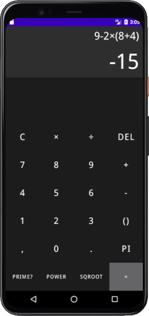
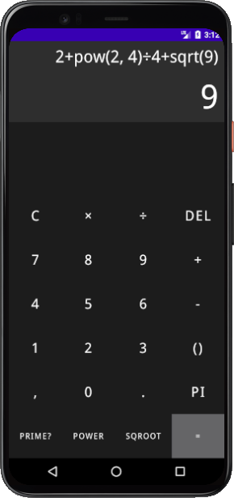
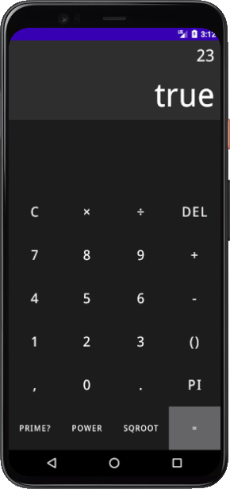

# Android calculator

Simple and user friendly Android calculator

## Screenshots

||||
|-|-|-|
||||

## TODO

- [ ] trigonometric functions
- [ ] factorial
- [ ] matrix calculations
- [ ] memory
- [ ] log, abs, hyperbolic functions
- [ ] more constants
- [ ] conversions

## License

Licensed under the [MIT License](LICENSE)
